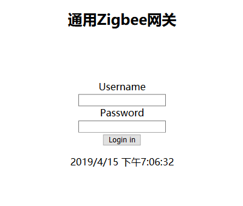
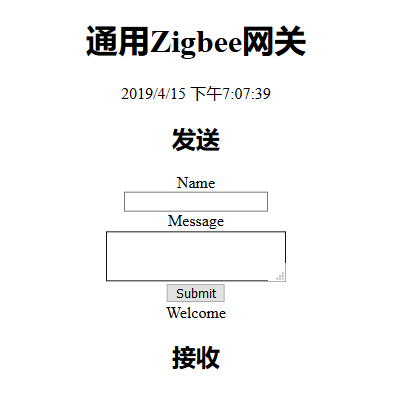
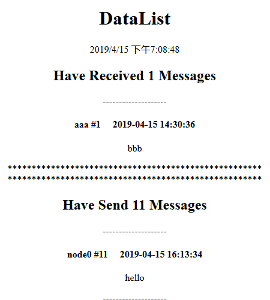

# 通用Zigbee网关 `毕设`
- Zigbee网关的作用是将zigbee网络里的数据转发至其他类型的网络（如互联网），同时可以将其他网络的数据转发至zigbee网络
- 通过flask假设web服务器，通过浏览器，人工输入数据及得到数据
## 程序运行
**克隆仓库**
    
    git clone https://github.com/ChenPY101/gateway
    cd gateway
**安装依赖**

    pipenv install 
    pipenv shell

***如果没有安装pipenv,可以通过pip安装（pip install pipenv）***

**其他**  
***路由***

    flask routes
    

    Endpoint           Methods    Rule
    -----------------  ---------  -----------------------
    api_delete         GET        /api/delete
    api_devices        GET        /api/devices
    api_discover       GET        /api/discover
    api_discover_init  GET        /api/discover_init
    api_index          GET        /api/index
    api_login          GET        /api/login
    api_logout         GET        /api/logout
    api_my_data        GET        /api/my_data
    api_received_data  GET        /api/received_data
    api_send_data      GET        /api/send_data
    dataList           GET        /data
    delete             GET, POST  /delete
    devices            GET        /devices
    discover           GET        /discover
    discover_init      GET        /discover_init
    hello              GET        /
    hello              GET        /hello/<name>
    index              GET, POST  /index
    login              GET, POST  /login
    logout             GET        /logout
    static             GET        /static/<path:filename>    

`ip为本地环回测试`
- 各api返回的json数据
- ***127.0.0.1:5000/data***  显示数据
- ***127.0.0.1:5000/delete***  删除一个zigbee节点
- ***127.0.0.1:5000/devices*** 展示zigbee节点
- ***127.0.0.1:5000/discover*** 发现/添加zigbee节点
- ***127.0.0.1:5000/discover_init*** 删除所有节点记录，重新添加节点
- ***127.0.0.1:5000/index*** 主界面（登录后自动跳转）
- ***127.0.0.1:5000/login*** 登陆
- ***127.0.0.1:5000/logout*** 登出 

***帮助***

    flask --help

    Commands:
    db      Perform database migrations.
    init
    initdb
    routes  Show the routes for the app.
    run     Runs a development server.
    shell   Runs a shell in the app context.

***初始化数据库*** 

    flask initdb
初始化（更新管理员信息）

    flask init

**运行**   
理论上

    flask run
就可以运行程序，但程序有报错，可以是程序里开了线程的关系吧

    ValueError: signal only works in main thread
可以使用

    python app.py
然后就可以在浏览器输入 ***127.0.0.1:5000*** 获取界面

***登陆*** ***127.0.0.1:5000/login***

***数据交换*** ***127.0.0.1:5000/index*** （登陆后自动跳转）

***数据*** ***127.0.0.1:5000/data***

## 注意
- api中采取全局变量验证登陆
- 利用txt保存数据，数据库仅保存管理员信息（将数据全保存至数据库失败了。。。）
- 运行前需修改xbees.py中的串口及波特率，及确保xbee模块能顺利组网
- 在linux下把串口改成/dev/tty类似的，并修改txt权限
- 应该写的差不多了，水平有限，可能还有很多问题 :bug:
